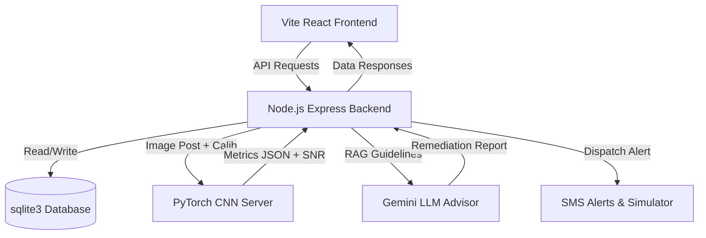

# Vita-Core Sentinel AI
`Vita-Core Sentinel AI` is a state-of-the-art agricultural monitoring platform designed for real-time soil health assessment using **Mycelial Glow Ingestion, Physical-Biological Calibration, & AI Telemetry**. By leveraging a PyTorch CNN model to analyze mycelial bioluminescent glow images and integrating with Google Gemini for RAG-enabled agronomy advisory, it empowers farmers with actionable, real-time insights, automated cellular alerts, and laboratory-grade diagnostics.

---

## 🏗️ System Architecture

The platform is designed around a three-tier architecture:



### 1. **Vite React Frontend** (`/frontend`)
- A modern, interactive dashboard built using **React 19**, **Vite**, and styled with **Tailwind CSS**.
- **Interactive Autopilot HUD Drone Simulator**: Renders a 60FPS canvas HUD representing live telemetry (airspeed, altimeter, artificial horizon pitch/roll) for autonomous sector sweeps.
- **Sensor Validation & Calibration Console**: Dynamic sliders (Gain, Cutoff, Ambient Lux, Mycelial Inoculation Age) mapped to real-time Signal-to-Noise Ratio (SNR) diagnostics.
- **Scientific Grounding Library**: Renders a literature database, biochemical pathway cycle graphs (Caffeic Acid Cycle), an interactive Soil Horizon Core Profiler, and an interactive pH-Bioavailability heavy metal toxicity curve simulator.
- **Institutional Lab Sheet Print View**: A custom CSS media-query printing wrapper that renders laboratory certificates onto exactly one page, complete with a barcode and team signatures.

### 2. **Node.js Express Backend** (`/backend`)
- REST API layer managing user authentication (with JWT and bcryptjs) and calibration settings.
- Built on top of **SQLite** (`sentinel.db`) with an asynchronous query wrapper (`database.js`).
- Handles file uploads using **Multer**.
- Integrates with the **Google Generative AI SDK** to provide AI-powered agronomy remediation reports.
- Dispatches emergency cellular SMS alerts using **Twilio** (falls back to a simulated SMS logger).

### 3. **AI PyTorch CNN Server** (`/ai`)
- Runs a lightweight Python Flask server on port `5001`.
- Uses a custom **PyTorch Convolutional Neural Network (CNN)** (`model.py` / `mycelium_cnn.pth`) to process and analyze bioluminescent mycelial glow patterns.
- Predicts key soil metrics:
  - **Nitrogen Level** (mg/kg)
  - **Moisture Content** (%)
  - **Soil pH**
  - **Stress Classification** (Low / High)
- **OpenCV Heuristic Fallback**: A robust fallback algorithm that parses image HSV green-channel contours to calculate metrics if PyTorch weights are missing.

---

## 📂 Project Directory Structure

```text
Project/
├── ai/                      # Python PyTorch CNN Model Server
│   ├── glow_server.py       # Flask server hosting the CNN model
│   ├── glow_analyzer.py     # Image preprocessing & analysis logic
│   ├── model.py             # Custom PyTorch CNN architecture
│   ├── train_model.py       # Model training script
│   └── mycelium_cnn.pth     # Pre-trained CNN model weights
│
├── backend/                 # Node.js Express API Backend
│   ├── server.js            # Main backend API entry point
│   ├── database.js          # SQLite connection and database init
│   ├── ai_bridge.js         # Integration wrapper calling the AI server
│   ├── sms_simulator.js     # Twilio SMS dispatch & logging simulator
│   ├── crop_guidelines.json # Reference guidelines for optimal soil metrics
│   ├── sentinel.db          # SQLite Database file
│   └── uploads/             # Directory for uploaded mycelial images
│
├── frontend/                # Vite + React 19 Frontend
│   ├── src/                 # React source code (components, hooks, styles)
│   │   ├── components/      # Dashboard panels (Heatmap, GlowVisualizer, ScientificLibrary)
│   │   ├── index.css        # Global CSS stylesheet (contains print media queries)
│   │   └── main.jsx         # Client mount entry point
│   ├── public/              # Static assets (glowing mushroom photographs)
│   └── index.html           # Main entry document
│
├── node_portable/           # Bundled portable Node.js runtime (v22.12.0)
│
├── start_sentinel.ps1       # PowerShell launcher script
├── start_sentinel.bat       # Windows Batch launcher script
└── README.md                # System documentation
```

---

## ⚙️ Setup & Configuration

### Prerequisites
1. **Python 3.8+** (with PyTorch, Flask, NumPy, and OpenCV/Pillow installed).
2. **Node.js** (A portable node version `v22.12.0` is pre-bundled in `node_portable/` for convenience).

### Environment Variables (`backend/.env`)
Configure your backend environment parameters inside `backend/.env`. Key parameters include:

```ini
PORT=5000
JWT_SECRET=vitacore_secret_jwt_key_2026

# Google Gemini API (for LLM Agronomy Advisor)
GEMINI_API_KEY=your_gemini_api_key_here

# Twilio Configuration (for SMS alerts)
TWILIO_ACCOUNT_SID=your_twilio_sid
TWILIO_AUTH_TOKEN=your_twilio_auth_token
TWILIO_FROM_NUMBER=your_twilio_phone_number
FARMER_PHONE_NUMBER=recipient_phone_number
```

---

## 🚀 Running the Application

### Option 1: Automatic Launcher (Simplest)
This script sets up the portable Node environment and starts all three services in separate windows automatically:
```powershell
powershell -ExecutionPolicy Bypass -File .\start_sentinel.ps1
```

### Option 2: Manual Startup (Run in 3 Separate Terminals)
Open three terminals in the project root folder and execute:

#### Terminal 1: AI Model Server (Python)
```powershell
python ai/glow_server.py
```

#### Terminal 2: Node.js Express Backend
```powershell
cd backend
$env:PATH = "$pwd\..\node_portable\node-v22.12.0-win-x64;$env:PATH"
node server.js
```

#### Terminal 3: React Frontend (Vite)
```powershell
cd frontend
$env:PATH = "$pwd\..\node_portable\node-v22.12.0-win-x64;$env:PATH"
npm.cmd run dev
```
*(Bypasses the PowerShell digital signature block using `npm.cmd`)*

---

## 📊 Core Features & Functionalities

### 📷 Bioluminescent Mycelial Glow Ingestion
Farmers can upload images of bioluminescent mycelium cultures grown on soil samples. The pre-trained PyTorch CNN analyzes the bioluminescent patterns (intensity, distribution, texture) to diagnose soil composition.

### 🎚️ Sensor Validation & Calibration (SNR)
- **Moonlight Noise Cancellation**: Cutoff slider filters out background light pollution (lux).
- **Aging Multiplier**: Gain slider compensates for biological mycelial degradation (0–45 days cycle).
- **Signal Link Seal**: Checks presence, wavelength peak (522 nm), SNR (>8 dB), and toxicity thresholds.

### 🧪 Scientific Grounding Library
- **Biochemical Reaction Pathway**: Mapped to **MDPI Biosensors (2022, 12, 353)** research paper describing the coupled NADH:FMN-oxidoreductase + Luciferase enzyme reaction system.
- **pH-Bioavailability Modulator**: Dynamic simulator modeling heavy metal solubility ($Cd^{2+}, Pb^{2+}, Cu^{2+}, Zn^{2+}$) and enzyme inactivation curves.
- **Soil Horizon core**: Interactive diagram mapping organic humus percentage, pH, and residual light from A-Horizon to D-Horizon bedrock.

### 🤖 RAG-Enabled AI Advisor & Closed-Loop Actuation
- **Gemini LLM Integration**: Generates detailed corrective steps when parameters breach thresholds.
- **Toxicity Lockout**: If bioluminescence is completely quenched (residual light $<50\%$), the RAG engine suspends standard NPK fertilization loops to avoid toxic runoffs, switching to bioremediation microbial guidelines.